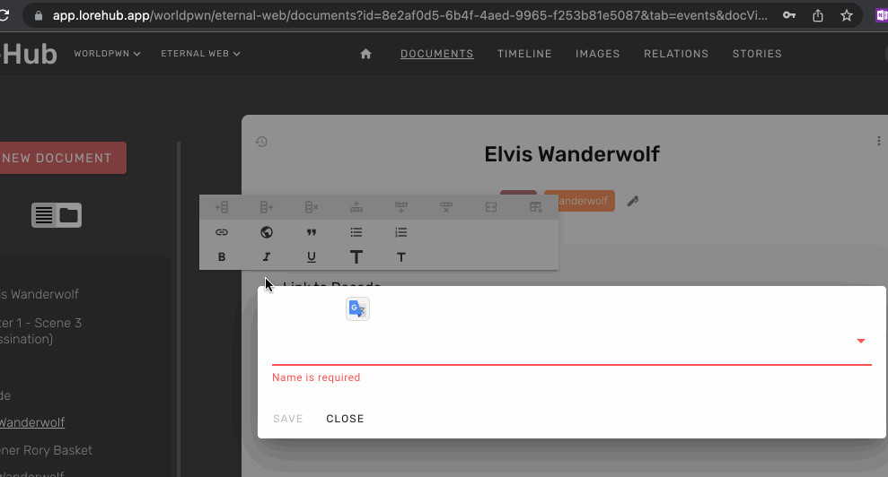
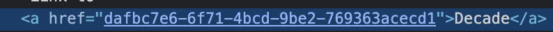

# tiptap-custom-link-vue-router

Example of custom [tiptap v2](https://github.com/ueberdosis/tiptap) link that is using vue router. 

I use it in [LoreHub](https://LoreHub.app) 

## Demo



It will generate this HTML code:


## Usage in code

``` javascript
// add link
this.editor
  .chain()
  .focus()
  .extendMarkRange("link")
  .setDocumentLink({ href: documentId })
  .run();

// remove link
this.editor
  .chain()
  .focus()
  .unsetDocumentLink()
  .run();
```


